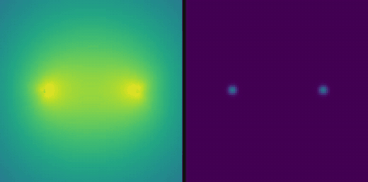
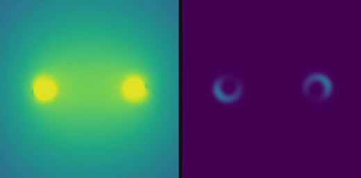
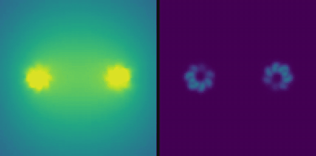
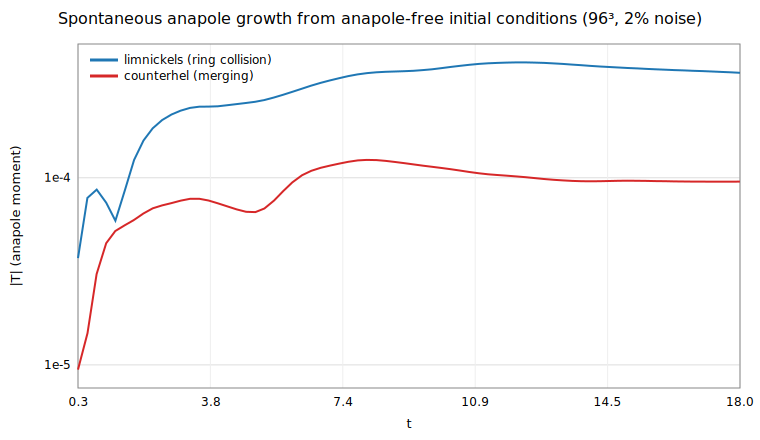
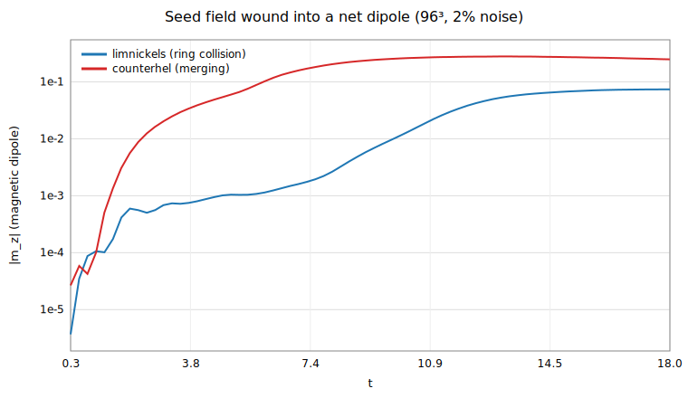
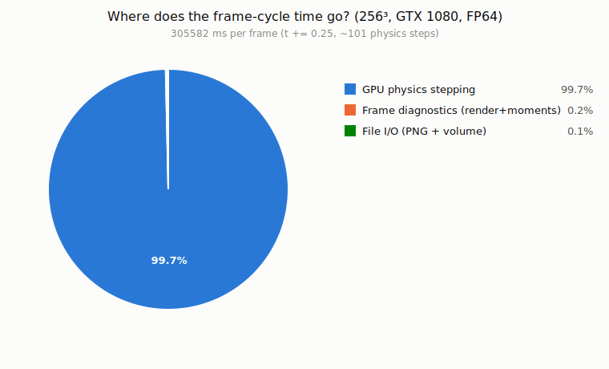
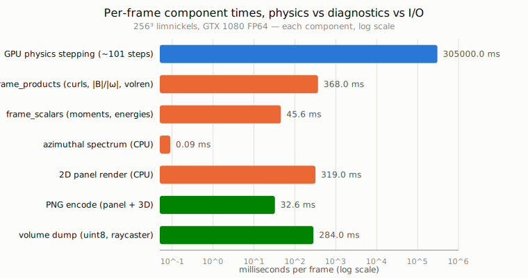
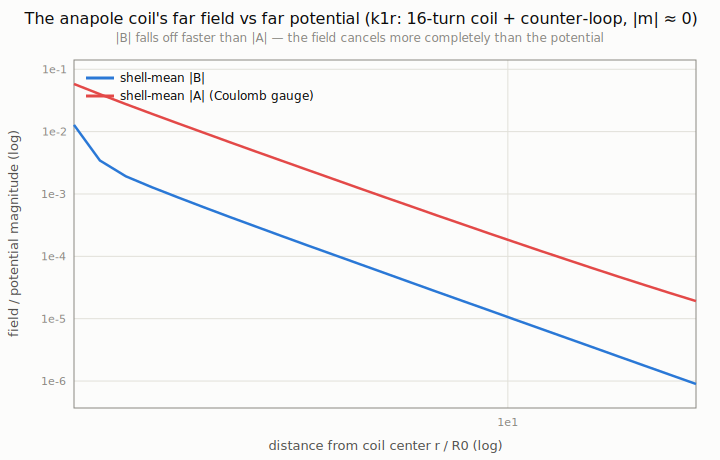
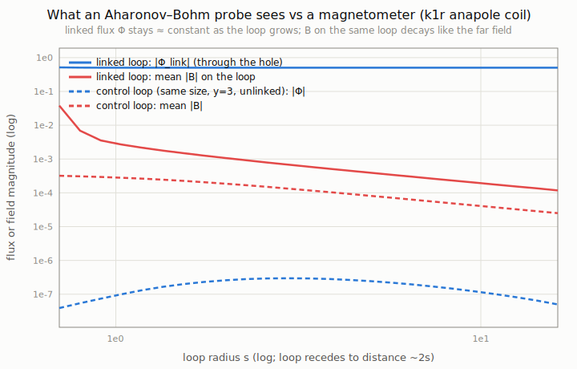

# Logbook

Companion to `README.md`. README is the stable design document — project
brief, model, equations, provenance, source list, experiment *plans*. This
file is the running experimental record: what was actually run, what came
out, and what it means, in the order it happened. When in doubt about which
file something belongs in: if it would still be true before running any
code, it's README; if it's a number or a conclusion that came out of a run,
it's here.

## v1: phase 1–3 first results

Quick-mode grids, windings 16/8 at ratio 1/4 (see README §3–§4a for the
model and code layout):

- **Phase 1**: nesting switches on the anapole moment and magnetic helicity
  (k=0: |T| = 0, H = 0 exactly; k=1: |T|/|m| ≈ 0.5, H > 0). The far field
  stays dipole-dominated (log-log slope ≈ −3): the fractal coil is *not*
  monopole-like in its static far field.
- **Phase 2**: at drive wavelength ~ coil size, deeper nesting radiates
  *more*, not less (longer wire at fixed peak current; the anapole
  non-radiating property is a quasi-static/point-source statement). After
  switch-off, the core field energy drops ~3 orders of magnitude within one
  light-crossing regardless of k — prescribed-current vacuum fields do not
  persist, as expected.
- **Phase 3** (48³, u₀ = 0.05c, t = 60/ω_p; `out/phase3/summary_*.csv`):
  - *uniform mode* (coil in a uniform quasineutral plasma): τ ≈ 51, 43, 41/ω_p
    for k = 0, 1, 2. Radiated energy is ≲0.1% — the medium traps radiation —
    and the torus fully phase-mixes away by t = 60.
  - *ball mode* (isolated quasineutral plasma torus in near-vacuum, the
    configuration the persistence claim is about): at 96³, τ ≈ 276, 125,
    74/ω_p for k = 0, 1, 2 (k = 0 agrees with the 48³ value 274 — well
    converged), with only a few % of the energy radiated; the tube structure
    is still recognizable at t = 60, with the density hollowing into a shell
    around each tube axis. An isolated quasineutral current ring is thus
    *quasi-stable* on ~10² plasma periods — but **each level of fractal
    nesting roughly halves the lifetime**, the opposite of the
    self-containment claim. For scale: 2-day persistence at solid-state-like
    densities would need τ ~ 10¹⁵–10²⁰/ω_p.

Known numerical caveats: SSP-RK3 weakly damps grid-scale modes (keep
structures ≳ 3 cells); the Gaussian splat's ∇·J ≠ 0 residue is handled by
Marder cleaning in phase 3 but uncorrected in phase 2; quick-mode grids are
coarse — treat trends, not absolute numbers, as meaningful.

### Videos

Phase-3 ball-mode relaxation at 96³ (t = 0 → 60/ω_p, 24 fps ≈ 10 s each;
left panel: log₁₀|B| on a fixed 3.5-decade scale, right panel: electron
density; xz-slice through the torus). Rendered inline during the simulation,
stitched with `scripts/make_videos.sh`:

Full-quality mp4s: [k = 0, bare current ring — τ ≈ 276/ω_p](out/videos/phase3_k0_ball.mp4)
· [k = 1, coil (16 turns) — τ ≈ 125/ω_p](out/videos/phase3_k1_ball.mp4)
· [k = 2, coil of coils (16×8) — τ ≈ 74/ω_p](out/videos/phase3_k2_ball.mp4)

**k = 0** (τ ≈ 276/ω_p):

**k = 1** (τ ≈ 125/ω_p):

**k = 2** (τ ≈ 74/ω_p):

## v2: first results

Implementation notes that turned out to matter: plain first-order Rusanov
destroyed the few-cell ring cores within an Alfvén time, so the fluxes use
MUSCL/minmod reconstruction (second-order); and the toroidal (twist)
component of the flux rings must also be built from a vector potential or
its *discrete* divergence pollutes the run.

64³ scenario suite (S = 500, t = 15 Alfvén times, videos in `out/videos/`):

- **No spontaneous anapole moment in any scenario**: |T| stays at machine
  zero throughout. Cause identified: the two-ring initial conditions are
  axisymmetric, and a clean grid gives azimuthal instabilities nothing
  physical to grow from — the azimuthal mode spectrum reads back the
  Cartesian grid's own m = 4 anisotropy (m = 8 harmonic in the vortex-ring
  collision) at the few-percent level. Lesson: the Lim–Nickels breakup is
  noise-seeded in real fluids, so the simulation must seed symmetry-breaking
  noise explicitly (added: 2% random velocity noise, deterministic seed).
- *counterhel* reproduces merging phenomenology: the rings attract, drive a
  current layer at the mid-plane, and reconnect into a single object with
  surviving net dipole (m_z ≈ 0.26); magnetic energy drops ~100× by t = 15
  (reconnection + residual numerical diffusion at 3-cell cores).
- *opposed*: the anti-parallel ring currents annihilate; the net dipole
  cancels to grid zero.
- *limnickels*: kinetic energy decays ~60× with the seed field passively
  advected; no magnetized sub-rings without noise seeding.

96³ noise-seeded runs (2% velocity noise, t = 18, videos
`v2_*_N96*.mp4`): **reconnection does spontaneously generate anapole
current structure — the first self-assembly signal of the project — but at
the sub-percent level.**

- *limnickels*: |T| grows smoothly from machine zero (7×10⁻¹⁷) to
  3.6×10⁻⁴, saturating by t ≈ 10 and holding; the weak seed field is wound
  into a net dipole (m_z: 4×10⁻⁶ → 0.07); the collision annulus breaks up
  at azimuthal mode m = 4 with relative amplitudes up to ~0.5 — well above
  the unseeded grid-anisotropy floor, though m = 4 is also the grid's
  preferred symmetry, so the mode *number* needs a rotated-IC or
  higher-resolution cross-check before it is trusted.
- *counterhel*: a transient anapole peaks at ~1.2×10⁻⁴ around t ≈ 8
  (mid-merge) and relaxes to ~1×10⁻⁴; the merged object keeps a slowly
  decaying dipole m_z ≈ 0.28. First 3D volume-rendered video stream
  (`v2_counterhel_N96_3d.mp4`).
- Time-series plots (SVG, from `scripts/plot_anapole.jl`):
  
  
- Scale honesty: the self-assembled anapole fraction is |T|/|m| ≈ 0.6%
  (limnickels) and ~0.04% (counterhel), versus ~50% for the hand-built v1
  fractal coil. Self-assembly of *weak* FTM character from anapole-free
  initial conditions: observed. Self-assembly of an actual fractal
  toroid: not at these parameters — the follow-up knobs are stronger seed
  field, higher resolution, and longer runs to test whether the saturated
  |T| is a plateau or a slow-growth phase.

**192³/256³ campaign (2026-07-19, GPU).** The higher-resolution, longer-time
follow-up called for just above.

- **Persistence — the plateau is real.** At 192³, limnickels |T| saturates
  at ~9.4×10⁻⁴ and holds flat from t ≈ 24 to t = 36 while kinetic energy
  falls 3.5× and magnetic energy 4.4×: a plateau, not a slow-growth phase, on
  this timescale. Since |T| = (1/10)∫[(r·J)r − 2r²J]dV is a functional of the
  current J = ∇×B, a constant |T| means a *current* persists — it is the
  fluid flow (E_kin) that dies, not the current. The field energy ∫B² also
  decays 4.4×, yet under a uniform decay B→fB one would have E_mag/|T|²
  constant; measured it drops ~5× (t = 20→36), so the decay is
  scale-selective. That is what resistive dissipation (∝ η k²) does — small
  scales first, leaving the largest-scale (lowest-k) toroidal current, which
  is exactly what the anapole measures. The anapole is the long-lived,
  large-scale survivor; it must eventually decay resistively (the longest
  timescale in the box), which t = 36 does not reach.
- **Mechanism — strength tracks the kinetic drive.** Peak |T| at 192³ orders
  with the vortex-ring circulation P0: limnickels (0.40) 9.4×10⁻⁴ > opposed
  (0.30) 5.9×10⁻⁴ (still rising at t = 18) > counterhel (0.10, magnetically
  dominated) 1.6×10⁻⁴. All three self-assemble a persisting anapole, so it is
  generic to the two-ring geometry — but its magnitude is set by the kinetic
  collision, not the field configuration (counterhel has the strongest fields
  and the weakest anapole).
- **Convergence — the plateau is a 192³ artifact.** The completed resolution
  ladder is *non-monotonic* (peak |T| / value at t = 36): 4.1×10⁻⁴ / 2.9×10⁻⁴
  (96³), 4.7×10⁻⁴ / 2.8×10⁻⁴ (128³), **9.4×10⁻⁴ / 9.4×10⁻⁴ (192³)**,
  4.0×10⁻⁴ / 1.8×10⁻⁴ (256³). Three of the four grids agree — the anapole
  peaks at ~4×10⁻⁴ around t ≈ 12–21 and then *decays*; only 192³ has the
  highest peak and is the only one that plateaus. So the persistence is a
  192³-specific artifact, most likely a resonance between the grid, the ring
  geometry, and the box's 4-fold boundary imprint: the anapole is r²-weighted,
  hence dominated by the outer region, and by t = 30 the field fills the box
  with a rounded-square (m = 4) boundary signature. Bulk energetics agree to
  ~14% across grids. The azimuthal mode is likewise grid-influenced (m = 4 at
  192³, m = 4/8 at 256³, m = 8/12 in opposed — grid harmonics), so the
  sub-ring *count* is not physical either. A larger-domain run (half = 4) is
  planned to confirm the boundary's role. A 192³ seed ensemble makes the case
  worse for the canonical run: at the same grid, seeds 2 and 3 peak at
  3.3×10⁻⁴ and 2.2×10⁻⁴ (seed 3 then decays) versus the canonical seed's
  9.4×10⁻⁴ — so the magnitude is dominated by the noise realization (~4–6×
  scatter at fixed grid), and seed 1234 was a high outlier in both its
  magnitude and its lone plateau.

Bottom line: a spontaneous anapole reliably *forms* (peaking near ~4×10⁻⁴,
strength ∝ vortex drive) but **does not persist** — three of four resolutions
show it peak and decay, and the 192³ plateau that first looked like
persistence is an outlier/artifact. No converged magnitude or sub-ring count
is established, and the domain likely biases the outer, anapole-dominant
region.

**Domain test (2026-07-19/20 night): the boundary controls persistence more
than "artifact" implied.** `limnickels 192 36 gpu half=4` — same resolution
as the 96³/half=2 ladder point (dx = 0.0417) but a domain twice as wide —
was run to test whether moving the sponge away kills the 192³/half=2 plateau.
Result is more interesting than a clean confirm/deny: |T| does **not**
plateau (unlike 192³/half=2) but it also does **not** peak-and-decay like
every half=2 grid did (96³/128³/256³) — it climbs *monotonically* through
the whole run, reaching 7.1×10⁻⁴ at t=36 and still rising, while E_kin and
E_mag are still actively falling (no quasi-steady state reached). At the
*same resolution*, the small box (half=2, 96³) peaks by t≈20 and decays to
2.9×10⁻⁴ by t=36; the large box (half=4, 192³) is still growing past that
value at t=36. So domain size is a real control knob on the persistence
question, not just a source of a single resonant artifact — a field with
more room before it reaches the absorbing boundary keeps organizing for
longer. What happens beyond t=36 in the larger box (does it eventually peak
and decay too, on a longer boundary-crossing time?) is untested as of the
night this was written — **see the "domain test, continued" entry below for
the extended-time result.**

**Domain test, continued (2026-07-20 day): it does eventually decay, but far
more gently than the small domain.** Extended the same half=4 run to t=60
then t=84. |T| keeps climbing well past the t=36 value, **peaking at
8.42×10⁻⁴ at t≈69** — 3–4× later and ~2× larger than the half=2/96³ peak
(4.1×10⁻⁴ around t≈12–21) — then turns over and declines to 8.24×10⁻⁴ by
t=84: a real peak-and-decay, so the small-domain pattern is universal after
all, but the decay itself is dramatically slower. In the small box, |T| falls
~4× in the ~16 time units after its peak; in the large box it has fallen
only ~2% in the 15 time units after its peak. So the fuller picture is:
domain size delays *when* the anapole peaks, increases *how large* it gets,
and slows *how fast* it decays afterward — three effects of the same cause
(more room before the field reaches the absorbing boundary), not a
plateau-vs-decay dichotomy. The 337-frame full run (t=0→84):
[2D panel](out/videos/v2_limnickels_N192_half4.0.mp4) ·
[3D volume render](out/videos/v2_limnickels_N192_half4.0_3d.mp4).

## v2: ULTR cavitation-collapse self-assembly (simplified MHD)

Bob Greenyer's ULTR experiment (water + aluminium foil in an ultrasonic
cleaner) is claimed to form FTMs via cavitation collapse, driven by "charge
separation + multi-axis hydrodynamic shear + standing waves." The charge
separation is inaccessible to quasineutral single-fluid MHD (that needs the
two-fluid/Euler–Maxwell model, `src/fluid.jl` — a v3+ direction); what *is*
testable now is the mechanism cavitation physics agrees on regardless of
cause: collapse → re-entrant jet → toroidal vortex ring. Implemented as two
new `scripts/v2_pathB_selfassembly.jl` scenarios, in a larger domain
(half=3, since the collapse emits shocks and the ring expands):

- **`bubble`**: a single low-density cavity (ρ_cav = 0.05, isothermal
  p = c_s²ρ makes it implode under ambient pressure) with a seeded
  re-entrant jet — a dense "foil" wall can't provide the collapse asymmetry
  here (it would be *high*-pressure under this EOS and explode outward), so
  the jet a nearby wall would normally produce is imposed directly.
- **`bubble2`**: two cavities collapsing side by side, asymmetry from mutual
  shielding alone, no seeded jet.

Both seed a weak axisymmetric flux ring (E_mag = 0.02, |T|(0) = machine
zero, same convention as every other scenario) plus 2% velocity noise.
192³, t = 36:

- The jet punches through the cavity and rolls up into a vortex ring, as
  cavitation theory predicts — visible in the ρ frame row added for these
  scenarios (`out/videos/v2_bubble_N192_half3.0.mp4`).
- **A spontaneous anapole forms here too**, an order of magnitude weaker
  than the vortex-collision scenarios (peak |T| ~5–9×10⁻⁵ vs ~4–9×10⁻⁴ for
  limnickels/opposed/counterhel) — consistent with the weaker seed field
  and gentler kinetic drive. `bubble` (continuously jet-fed) keeps growing
  through t=36 (8.5×10⁻⁵, still rising); `bubble2` (single collapse, no
  redrive) saturates by t≈10 and holds (~6×10⁻⁵).
- Seed scatter (seeds 2, 3 at 192³) stays within a factor ~2.4× of the
  canonical run (3.6–8.6×10⁻⁵) — tighter than the 4–6× scatter seen in the
  limnickels campaign. Resolution check (`bubble`/`bubble2` at 256³) agrees
  with 192³ to within ~2× at matched t. Azimuthal mode is m=4 throughout —
  the same grid harmonic as every other scenario, not a physical count.
  Videos: [seed 2](out/videos/v2_bubble_N192_half3.0_seed2.mp4) ·
  [seed 3](out/videos/v2_bubble_N192_half3.0_seed3.mp4) ·
  [bubble2 seed 2](out/videos/v2_bubble2_N192_half3.0_seed2.mp4) ·
  [bubble 256³](out/videos/v2_bubble_N256_half3.0.mp4) ·
  [bubble2 256³](out/videos/v2_bubble2_N256_half3.0.mp4).
- Bottom line: the cavitation-collapse mechanism reproduces the textbook
  jet→ring fluid dynamics, and *also* spontaneously organizes a weak
  anapole, but weaker than driven vortex collisions and with the same
  unresolved grid-mode caveat.

## v2: haphazard initial conditions (the `random` scenario)

`scripts/v2_pathB_selfassembly.jl random`: a band-limited random
divergence-free velocity field (E_kin = 2.5, k ≤ 3) plus a weak random
divergence-free seed field (E_mag = 0.05), no imposed ring geometry at all —
the test of whether coherent toroidal structure crystallizes out of pure
disorder rather than a symmetric two-ring collision. 192³, t = 36:

- |T| grows **very fast and very large** — peaking at 5.6×10⁻² by t≈2.75,
  ~60× the peak of any two-ring scenario — then decays roughly 4.5× to
  1.2×10⁻² by t=36, still ~15–25× every ring-collision scenario's final
  value. Turbulent collapse organizes far more anapole content than a
  symmetric collision does, at least transiently.
- The azimuthal mode spectrum is dominated by **m=1**, not the m=4 that
  every axisymmetric two-ring scenario locks onto — evidence that m=4 really
  was an artifact of combining an axisymmetric IC with the cubic grid's
  4-fold symmetry: freed from that symmetry, the grid's preferred mode
  doesn't win. (m=1 here most likely reads as one off-center dominant
  clump rather than a "ring of rings," visible in the render — see the
  scenario-comparison figure below.)
- The 3D render (`out/videos/v2_random_N192.mp4`) shows a genuinely
  disordered, space-filling tangle at t=12, in sharp visual contrast to
  every ring-based scenario's compact torus/pair-of-tori structure.

## v2: compute profile

Where does wall time actually go on a production GPU run? Instrumented
`limnickels` at 256³ on the GTX 1080, FP64 (`scripts/bench_gpu_profile.jl`,
mirrors the real per-frame code path): per frame cycle (Δt = 0.25, ~101
physics steps), GPU stepping takes 304.5 s versus a combined 1.05 s for
*everything else* — curls/magnitudes/volume-raycast/downloads (0.37 s),
moment/energy reductions (0.05 s), the CPU azimuthal-spectrum diagnostic
(0.09 ms), the 2D panel raster (0.32 s), and all file I/O — PNG encodes plus
the uint8 volume dump for the interactive raycaster (0.32 s). **Physics
stepping is 99.7% of the wall time**; rendering, diagnostics, and disk I/O
combined are noise, and the async-writer overlap (commit 458c50f) that
hides them behind the next stepping stretch was already the right
optimization target — there is nothing left worth optimizing on the I/O
side at this grid size.

## v3: first results

**Experiment (a), the anapole null, quantified** — `scripts/v3_anapole_null.jl`
computes B and A of the v1 hand-built coil directly from the line current
(no grid), for the "proper anapole coil" variant that superposes a
counter-oriented plain ring onto the k=1 coil to cancel the net dipole
(m drops from 3.24 to 0.096; |T| = 1.56 unchanged). Two measurements:

- **Shell-averaged far field vs far potential.** From r = 1.5 R0 to
  r = 22.8 R0, |B| falls from 0.0128 to 8.97×10⁻⁷ (a power-law slope
  ≈ −3.5) while |A| (Coulomb gauge) falls only from 0.058 to 1.91×10⁻⁵
  (slope ≈ −2.9). The field cancels measurably faster than the potential —
  the gauge-dependent version of "potentials survive where fields don't."
- **The gauge-invariant version**: linked flux Φ = ∮A·dl around a loop
  threading the coil's hole, versus the field on that same loop. Growing
  the loop from s = 0.7 to s = 16.2 (the loop's far side recedes to
  ~2s ≈ 32 R0), Φ_link stays flat at −0.51 → −0.50 (2% drift, essentially
  the tube flux) while the mean |B| sampled on the very same loop falls
  from 0.31 to 1.2×10⁻⁴ (>2500×) — matched against a same-size, same-distance
  *non-linking* control loop, whose Φ is at the ~10⁻⁷ numerical floor
  throughout. This is exactly what an Aharonov–Bohm-sensitive matter-wave
  probe would read that no magnetometer on the same path would: a
  quantitative version of Greenyer's "potential wave" claim, and the
  natural precursor to the coherent-receiver experiment (b).

**GPE groundwork.** `src/gpe.jl` implements the minimally-coupled
Gross–Pitaevskii condensate + Lorenz-gauge potentials of README §8's model:
`i∂tψ = [(−i∇−qA)²/2m + qφ + g|ψ|²]ψ`, `□φ = q(|ψ|²−n̄)`, `□A = J(ψ)`, on
the shared SSP-RK3 method-of-lines harness (10 cell-centered fields,
stdlib-only). Validation suite (`test/gpe_tests.jl`, all passing): free
wave-packet dispersion matches the analytic σ(t) to <3%; a uniform
condensate's chemical-potential phase winding µ = gn₀ matches to <0.1%;
a charged uniform condensate kicked with a uniform **A** oscillates at
ω_p = 1 (the coherent-matter analogue of the v1/phase-3 Langmuir test,
crossing zero at t = π/2 to <3%); a vortex–antivortex line pair keeps its
quantized winding (±1) exactly through evolution, as required
topologically. This is the substrate the coherent-receiver and
quantized-toroidal-current experiments (b, c) will run on next.
